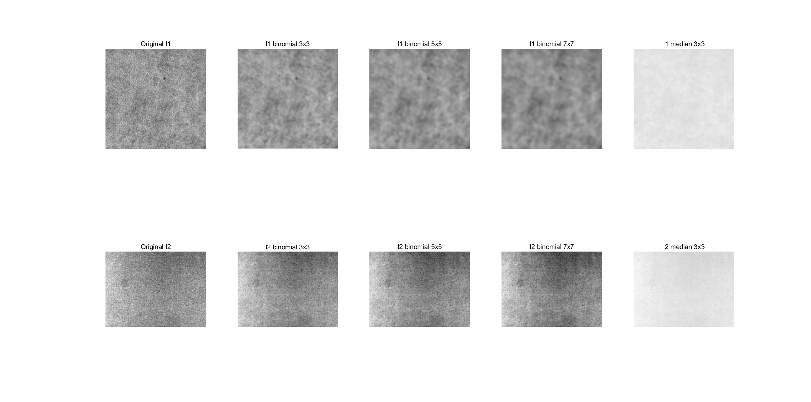
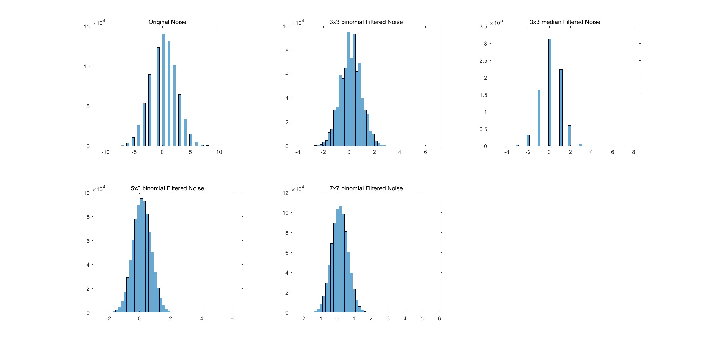

# Industrial Computer Vision Sandbox: From Sensor Noise to 3D Stereo Reconstruction

This repository implements an end-to-end industrial computer vision pipeline, bridging the gap between hardware sensor physics and geometric vision algorithms. The project utilizes physical industrial camera networks to validate theoretical vision models under strict quantitative error benchmarks.

---

## Project Objectives

The primary objective of this project is to construct a verifiable software sandbox that quantifies how low-level hardware sensor characteristics impact high-level geometric 3D spatial reconstruction. 

By analyzing the data flow from raw photon capture to dense point cloud synthesis, this project aims to:
1. Quantify the mathematical relationship between hardware amplification (Gain) and stochastic noise distributions under varying exposure constraints.
2. Resolve the limits of morphological feature extraction under adverse, non-uniform industrial illumination environments.
3. Implement a sub-pixel accurate geometric calibration and stereo rectification framework capable of recovering millimeter-level 3D spatial metrics from dual 2D optical projections.

---

## Repository Structure and Core Principles

### Module 1: Sensor Noise Analysis and Spatial Filtering
* Path: module_1_noise_and_filters
* Core Principle: This module evaluates the stochastic behavior of CMOS sensors using Poisson Statistics. It isolates dark current and thermal noise via consecutive frame subtraction at static luminance centroids. Spatial convolution kernels are then evaluated to balance high-frequency noise attenuation against structural edge preservation.

### Module 2: Morphological Feature Extraction and Parameter Space
* Path: module_2_blob_and_features
* Core Principle: This module focuses on segmentation stability. It evaluates the physics of light interaction with metallic surfaces (Reflected Light vs Transmitted Light) to optimize image binarization. Furthermore, it leverages the mathematical duality between the spatial image domain and the parametric Hough Accumulator Space to resolve linear boundaries without heuristic tracking.

### Module 3: Geometric Calibration and 3D Stereo Reconstruction
* Path: module_3_stereo_reconstruction
* Core Principle: Grounded in the Projective Pinhole Camera Model and Epipolar Geometry. It computes intrinsic matrices to correct radial and tangential lens distortions. By executing coplanar Stereo Rectification, it restricts the 2D correspondence search to a efficient 1D horizontal scanline, enabling dense depth mapping via Semi-Global Matching (SGM).

---

## Quantitative Performance and Experimental Results

### 1. Sensor Noise and Filter Trade-Offs (Module 1)
Experimental evaluation proved the deterministic conflict between high hardware gain and Signal-to-Noise Ratio (SNR) preservation. 
* Low-Gain Configuration (0 dB, 101 ms exposure): Produced a stable baseline with a mean noise amplitude of $\bar{n} = 1.2163$.
* High-Gain Configuration (18 dB, 12 ms exposure): Caused a massive $7.5\times$ amplification in noise amplitude, reaching $\bar{n} = 9.1764$. This proves that maximizing exposure time to capture deterministic photons is superior to electronic amplification for SNR optimization.
* Filtering Limitations: While a 7x7 Binomial filter reduced residual noise amplitude to 0.2646, it introduced heavy defocusing and blurred structural boundaries. The 3x3 Median filter provided the optimal balance for edge preservation.
* Edge Gradient Failure: Evaluation of the Laplacian operator revealed that as a second-order derivative, it is highly sensitive to noise. Without prior Gaussian smoothing, the Laplacian operator generates severe false edges, whereas first-order Sobel and Prewitt operators maintain directional robustness.

| Filter Typology | Residual Noise Amplitude | Structural Edge Preservation |
| :--- | :---: | :---: |
| Unfiltered Raw Frame | 1.2163 | Baseline |
| Binomial 3x3 | 0.6052 | Minor Blur |
| Binomial 7x7 | 0.2646 | Heavy Defocusing |
| Median 3x3 | 0.8655 | Excellent Boundaries |

<p align="center">
  
  
</p>
<p align="center">
  <em>Figure 1: Comparison matrix of spatial filters (left) and the corresponding noise amplitude histogram reduction (right).</em>
</p>

### 2. Illumination Invariant Target Tracking (Module 2)
* Light Model Defect: Utilizing Reflected Light (top-down illumination) on metallic targets induced severe specular blooming and cast shadows. This corrupted the binarization threshold, causing the calculated area and radius distributions of identical targets to overlap, leading to misclassification.
* Light Model Solution: Implementing Backlighting (Transmitted Light) eliminated surface reflections, converting the domain into a clean binary silhouette. The area statistics shifted into perfectly separated Bimodal Gaussian Peaks, achieving 100% classification reliability.
* Analytical Corner Extraction: By mapping lines into the Hough Accumulator Space across rotational vectors, a custom mathematical pipeline successfully extracted checkerboard calibration corners directly from the intersections of orthogonal Hough peaks, bypassing standard heuristic line trackers.

<p align="center">
  
  
</p>
<p align="center">
  <em>Figure 2: Specular reflection error under Reflected Light (left) vs stable morphological segmentation under Transmitted Backlighting (right).</em>
</p>

### 3. Sub-Pixel Calibration and Dense 3D Synthesis (Module 3)
* Calibration Precision: Using a 3-parameter Radial and Tangential distortion model, the monocular calibration achieved a highly precise Mean Reprojection Error of 0.1312 Pixels, well below the strict industrial threshold of 0.5 pixels.
* Planar Distance Homography Limits: 2D pixel coordinates were projectively mapped to the world coordinate plane via the extrinsic matrices. Under high structural sensor tilt, a ground-truth length of 132.00 mm was evaluated as 135.76 mm. This bounds the absolute spatial measurement error to 3.76 mm (97.2% metric accuracy), revealing that homography projections degrade as the viewpoint eccentricity increases.
* Stereo Disparity: The computed Fundamental Matrix aligned the dual camera views into coplanar, horizontally aligned scanlines. The Semi-Global Matching (SGM) algorithm successfully resolved complex depth boundaries within the laboratory space, generating a high-density disparity field.

| Target Calibration Metric | Empirical Estimation Result | Nominal Hardware Specification |
| :--- | :---: | :---: |
| Mean Reprojection Error | 0.1312 Pixels | < 0.5000 Pixels (Pass) |
| Stereo Baseline Distance | 62.89 mm | 63.00 mm (Physical Nominal) |
| System Measurement Precision | Approx 97.2% Accuracy | Millimeter-level local tolerance |

<p align="center">
  
  
</p>
<p align="center">
  <em>Figure 3: Aligned 1D Epipolar search lines (left) and the computed coplanar Stereo Rectified red-cyan anaglyph array (right).</em>
</p>

<p align="center">
  
  
</p>
<p align="center">
  <em>Figure 4: Pixel disparity map generated via Semi-Global Matching (left) and the final reprojected, navigable 3D Spatial Point Cloud (right).</em>
</p>

---

## Method Verification and Execution

### Prerequisites
The implementation requires MATLAB R2022b or later with the following licenses verified via the Command Window:
```matlab
license('test', 'Computer_Vision_Toolbox')
license('test', 'Image_Processing_Toolbox')

```

### Execution Steps

1. Spatial Filtering Evaluation: Execute the script located at `module_1_noise_and_filters/2_noise_filter/src_code/noise_filter_script.m` to output the statistical noise attenuation profiles.
2. Invariant Target Tracking: Run `module_2_blob_and_features/1_blob_analysis/src_code/blob_coin_counting_pipeline.m` to benchmark the silhouette extraction engine.
3. 3D Spatial Reconstruction: Execute `module_3_stereo_reconstruction/src_code/stereo_measurements.m` to initialize the calibration matrices and render the dense point cloud.


