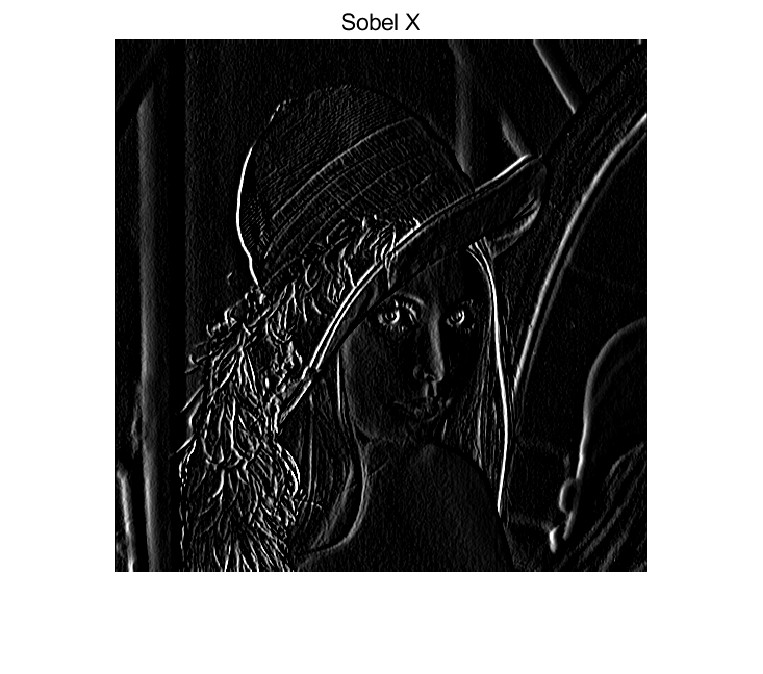
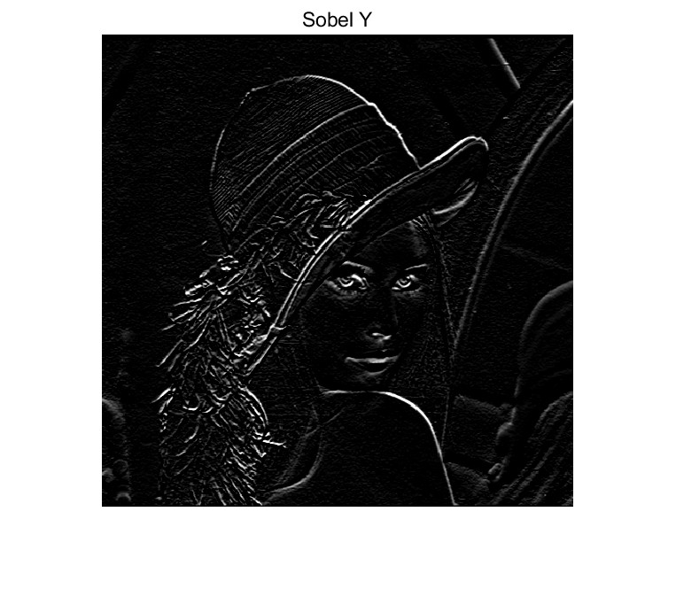
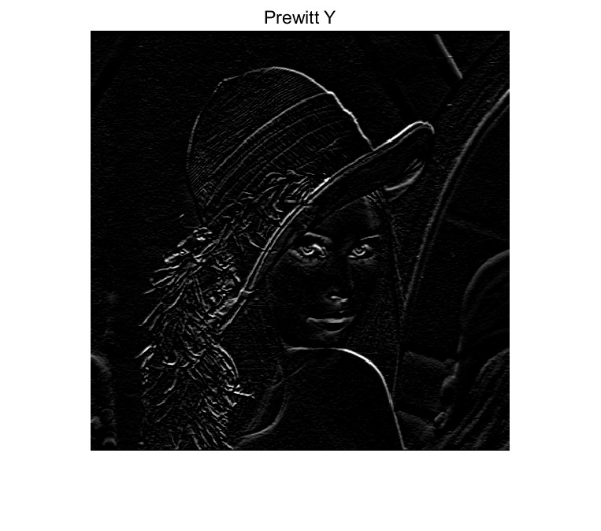
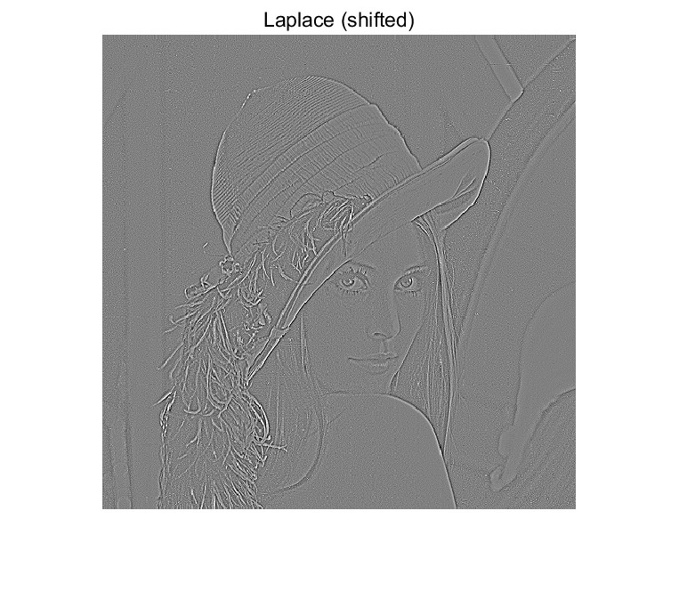
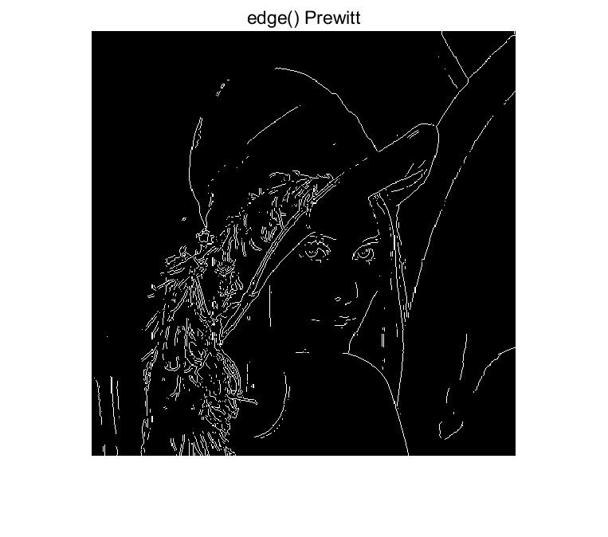

## 1.5

### Sobel
The Sobel operator produces stronger and sharper edges, because it uses weighted gradients.
* Sobel-X highlights vertical edges.
* Sobel-Y highlights horizontal edges.
 
 
 

 
---
### Prewitt
The Prewitt results look similar as soble, but the edges are slightly weaker and more sensitive to noise, since the operator has no weighting.
* Prewitt-X highlights vertical edges.
* Prewitt-Y highlights horizontal edges. 

 
 

---
### Laplace
The Laplace filter reacts to intensity changes in all directions. 
* Laplace filter does not provide directional information.
* Laplace filter amplifies noise clearly. 
The output contains positive and negative values, so a shift (we used "+128") is needed to display it correctly.

 

---
### edge()
The edge() function gives cleaner and more stable edge maps compared to manual filtering. 
It applies thresholding and normalization internally, so the detected edges are more connected and contain less noise.

 
 

---
### Overall
* Sobel and Prewitt are useful for simple gradient-based edge detection.
* Laplace is more sensitive to noise and provides less clear edges. 
* The results match the theoretical characteristics of the three operators.