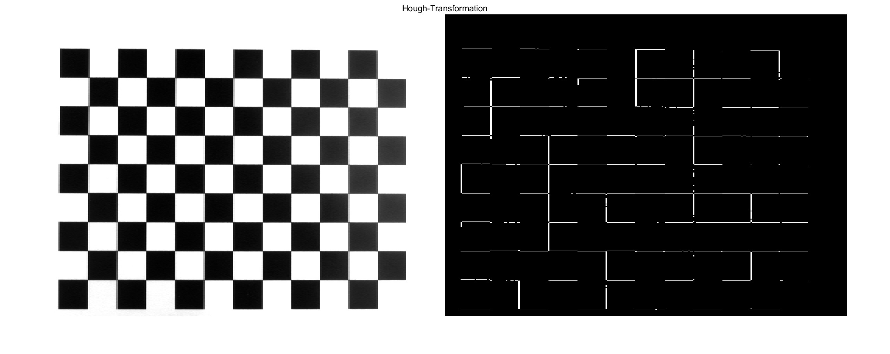
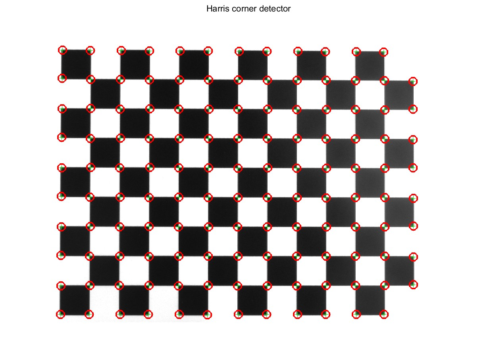
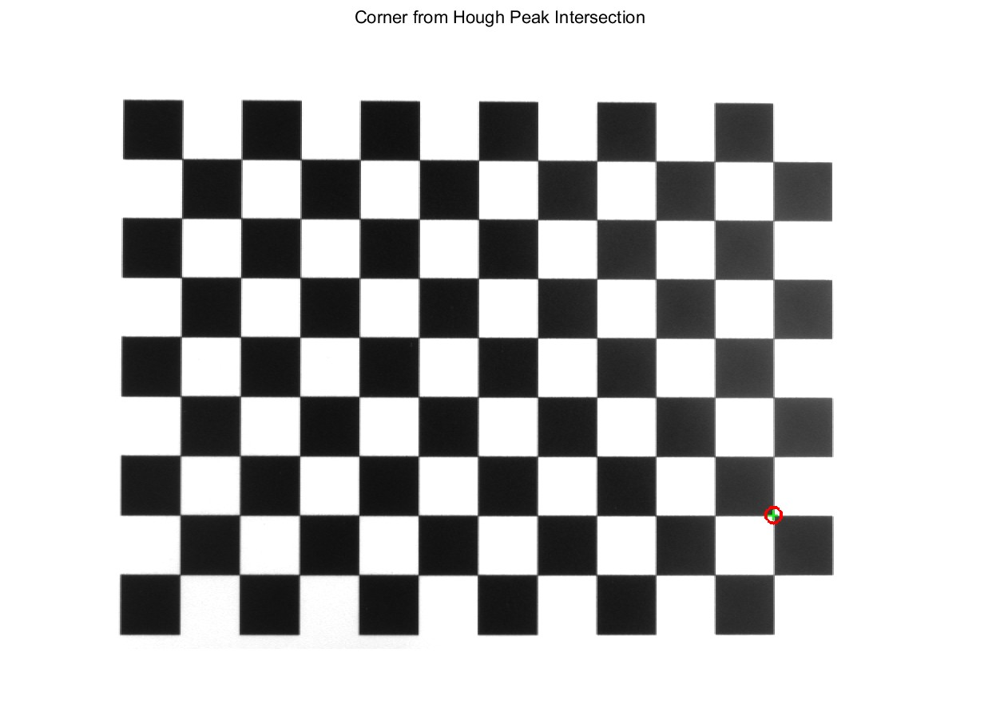

# Part 2 Hough Transform and Corner Detection
## 2.6 Analyzing a calibration pattern

---

• Take an image of the pattern and analyze it with the HT and the Harris-Corner-Detector. 



• Try to adjust the parameters to find all the edges and corners in the chessboard pattern. 

    nPeaks = 23;        
    fillGap = 500;        
    minLength = 500;      
    threshold = 0.5; 





• Find a method to calculate the corners of the chessboard directly from the houghpeaks, without using houghlines. You do not need to calculate all corners, an example will do. 

    Detect peaks in the Hough to get parameters (ρ, θ);
    The formula:
    ρ = x * cosθ + y * sinθ 
    represent lines;
    
    Then compute intersections of pairs of these lines by solving
    A = [cos(θ_1) sin(θ_1);
         cos(θ_2) sin(θ_2)];
    B = [ρ_1; ρ_2];
    xy = A \ B;  % The intersection cordinate

    The intersection points represent corner locations.

```matlab
%% ==== Method to get chessboard corners WITHOUT houghlines ====
% Using intersection of two lines defined by Hough peaks
% This method computes a chessboard corner by intersecting twolines
% obtained from the strongest Hough peaks. 
% Instead of relying on houghlines(), we directly use theanalytical
% line equations from the Hough transform.
% use the first two dominant Hough peaks
peak1 = 1;
peak2 = 2;
% Extract (rho, theta) values from the Hough accumulator
% peaks stores indices into H, where:
%   peaks(k,1) → row index in rho (distance)
%   peaks(k,2) → column index in theta (angle)
rho1 = rho(peaks(peak1,1));
theta1 = deg2rad(theta(peaks(peak1,2)));
rho2 = rho(peaks(peak2,1));
theta2 = deg2rad(theta(peaks(peak2,2)));
% Convert each Hough line from polar form
%       rho = x*cos(theta) + y*sin(theta)
% to the linear form:
%       a*x + b*y = rho
% where a = cos(theta) and b = sin(theta)
a1 = cos(theta1); 
b1 = sin(theta1);
a2 = cos(theta2);
b2 = sin(theta2);
% Form the linear for the intersection:
% 
%   [a1  b1] [x] = [rho1]
%   [a2  b2] [y]   [rho2]
%
% Solving this 2×2 matix yields the (x, y) coordinate where the
% two Hough lines intersect — which corresponds to onechessboard corner.
A = [a1 b1;
     a2 b2];
B = [rho1; rho2];
% Solve the matrix using left division (A \ B)
corner_xy = A \ B;
% Display the result
figure; 
imshow(Ib); 
title('Corner from Hough Peak Intersection');
hold on;
% Plot the detected corner as a red circle
plot(corner_xy(1), corner_xy(2), 'ro', ...
     'MarkerSize', 10, 'LineWidth', 2);
    
```




• Try to assess the precision of the Harris-Corner detector measurements. How can you achieve this?


    Calculate the average distance between each point 
    using the coordinate data from Harris and Hough Corner.

```matlab
%% assess the precision of the Harris-Corner 

hough_corner_x = corner_xy(1);
hough_corner_y = corner_xy(2);

select_corner = 115;
harris_corner_x = strongest.Location(select_corner,1);
harris_corner_y = strongest.Location(select_corner,2);

distance = sqrt((harris_corner_x-hough_corner_x).^2 
            + (harris_corner_y-hough_corner_y).^2);

```