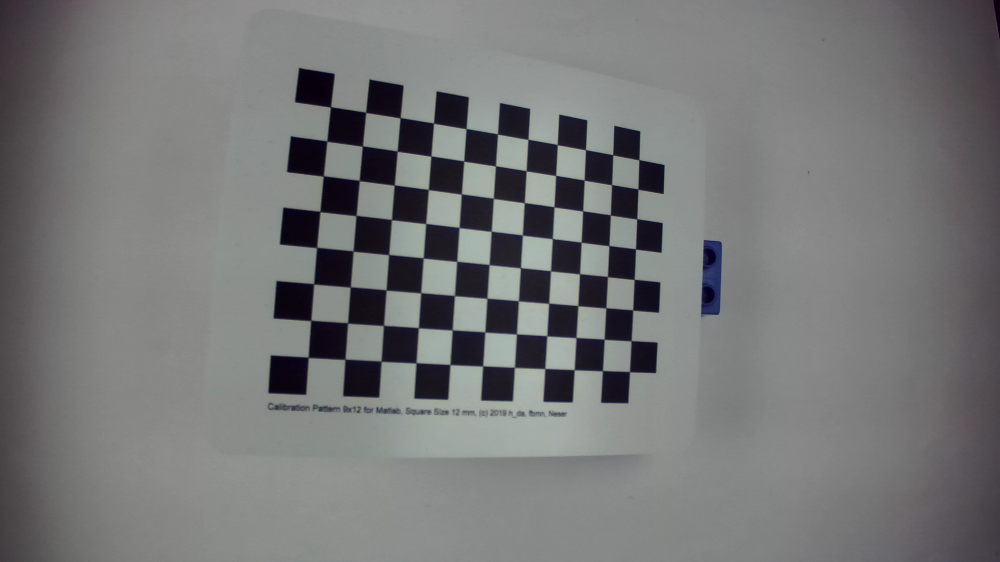
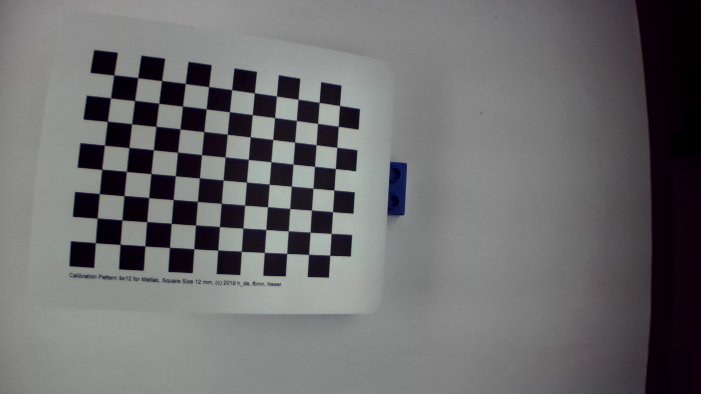

## Part 3. Acquire Images for Single-View- and Stereo-Measurements
---
### Obtain 15-20 images in a stable geometric configuration
#### Image Examples from 20 images
* Left(Camera1)

* Right(Camera2)

---
## Part 4 Single Camera Calibration

### 4.1 Camera Calibration
#### A.Theory

> Camera calibration is the process of estimating the parameters of the lens and image sensor. The mathematical model used is the **Pinhole Camera Model**, augmented with lens distortion.
> 1. **Intrinsic Parameters ():** These define how the camera maps 3D camera coordinates to 2D image coordinates. They include the focal length () and the principal point ().
> 2. **Extrinsic Parameters ():** These define the position and orientation of the camera in the world coordinate system.
> 3. **Distortion Model:** Real lenses deviate from the ideal pinhole model. We model this using:
> * **Radial Distortion ():** Caused by the shape of the lens (e.g., barrel or pincushion distortion).
> * **Tangential Distortion ():** Caused by the lens and image plane not being perfectly parallel.
> The calibration is performed by detecting known feature points (checkerboard corners) in multiple images and minimizing the **Reprojection Error**—the distance between the projected points and the detected image points.

#### B.Result

##### 1. Intrinsic Parameters 

| Category | Parameter | Value |
| --- | --- | --- |
| Focal Length | fx | 1.41E+03 |
|  | fy | 1.41E+03 |
| Principal Point | cx | 1.11E+03 |
|  | cy | 6.43E+02 |
| Overall Metric | Mean Reprojection Error | 0.1001 |
 
##### 2. Intrinsics Estimation Errors

| Category | Parameter | Value |
| --- | --- | --- |
| Focal Length Error | fx | 0.7082 |
|  | fy | 0.6764 |
| Principal Point Error | cx | 0.2968 |
|  | cy | 0.2671 |
| Radial Distortion Error | k1 | 3.20E-04 |
|  | k2 | 8.45E-04 |
|  | k3 | 6.89E-04 |
| Tangential Distortion Error | p1 | 2.29E-05 |
|  | p2 | 2.19E-05 |

#### C.Dissccusion
> 1. **Focal Length stability:** The values for  and  () are nearly identical, confirming a consistent pixel aspect ratio. The estimation errors are less than 0.7 pixels, which is negligible compared to the focal length itself, indicating a highly reliable calibration.
> 2. **Principal Point accuracy:** The estimated center () is consistent with the image resolution. With estimation errors below 0.3 pixels, the location of the principal point is determined with high confidence.
> 3. **Distortion Model:** The errors for both radial and tangential distortion parameters are extremely small (order of  and ). This confirms that the selected distortion model fits the lens characteristics well.
> 4. **Reprojection Error:** The mean error of 0.10 pixels represents a high-quality calibration result. Since the error is far below 1 pixel, the model achieves sub-pixel precision in mapping 3D points to the 2D image plane.
> 5. **Conclusion:** Overall, the calibration is successful. The combination of stable intrinsic parameters and an extremely low reprojection error proves that the camera model is accurate enough for the subsequent measurement tasks.

---

---

### 4.2 Distortion correction
#### A.Theory
> Once the intrinsic parameters and distortion coefficients are known from Section 4.1, we can mathematically "undistort" the images. The `undistortImage` function applies an inverse mapping: for every pixel in the corrected output image, it calculates the corresponding coordinate in the distorted input image using the distortion model and interpolates the pixel value. This process straightens lines that appear curved in the raw footage due to radial distortion.

#### B.Result

##### Distortion in the Original Image

 

##### Results After Applying undistortImage()

#### C.Disccussion
> 1. **Visual Inspection:** As shown in the "Distortion in the Original Image", straight lines (such as the edges of the checkerboard or shelves in the background) appear curved, exhibiting barrel distortion typical of wide-angle lenses.
> 2. **Correction Result:** After applying `undistortImage`, the edges in the second figure become straight. The "fish-eye" effect is removed, confirming that the radial distortion parameters () estimated in the calibration step are accurate.
> 3. **Boundary Artifacts:** Some pixels at the image borders may be lost or stretched during this transformation, which is a normal side effect of the warping process ("OutputView" set to "same").

---

---

### 4.3 Measurements with the calibrated camera
#### A.Theory
> To measure objects on a plane, we must map 2D image points back to 3D world points. Since a single camera lacks depth information, this is generally impossible without constraints. However, if we know the object lies on a specific plane (Z=0 in the world frame defined by the checkerboard), we can perform the transformation:
> 1. **Pose Estimation:** We calculate the extrinsic parameters ( and ) for the specific measurement image relative to the calibration board using `extrinsics()`.
> 2. **Back-projection:** Using the intrinsic matrix (), extrinsics (), and the constraint , we can uniquely solve for  and  from image coordinates .
> 3. **Euclidean Distance:** The real-world distance between two points  and  is calculated as .

#### B.Result

##### Figure: Acquisition and Undistortion 

##### Table: Estimated Rotation Matrix R

|  | Col 1 | Col 2 | Col 3 |
| --- | --- | --- | --- |
| **Row 1** | 0.9766 | -0.0776 | 0.2004 |
| **Row 2** | 0.0933 | 0.9931 | -0.0697 |
| **Row 3** | -0.1936 | 0.0868 | 0.9772 |

##### Table: Estimated Translation Vector t

| Component | Value |
| --- | --- |
| **x** | -71.77583 |
| **y** | -48.8507 |
| **z** | 230.3177 |

##### Table: Pixel coordinates of the selected points

| Point | X | Y |
| --- | --- | --- |
| Point 1 | 675.1820 | 345.3620 |
| Point 2 | 1414.5860 | 785.8579 |

##### Table: World coordinates of the selected points

| Point | X | Y |
| --- | --- | --- |
| Point 1 | -0.2071 | 0.0504 |
| Point 2 | 119.8017 | 83.9443 |

##### Table: Computed Euclidean distance and comparison with expected value

| Metric | Value |
| --- | --- |
| Computed Euclidean Distance | 146.4252 mm |
| Expected Real Distance | 147 mm |

#### C.Disccussion
> **1. Dimensionality Loss and the Planar Constraint**
> In a standard pinhole camera model, the projection from 3D space to a 2D image plane is a "many-to-one" mapping. A single pixel  actually represents an entire ray extending from the camera center into infinity. Without additional depth information, it is impossible to determine where along that ray a point lies.
> We overcome this by introducing a **Planar Constraint**. Since our measurement target is a flat checkerboard, we define the world coordinate system such that all points on the board lie on the plane .
> 
> **2. The Mathematical Bridge: Intrinsics and Extrinsics**
> To map the selected pixel points back to this world plane, the algorithm performs a back-projection using two sets of parameters:
> 
> * **Intrinsics ():** Removes the "perspective" effect of the lens, transforming pixel coordinates into normalized camera coordinates.
> * **Extrinsics ():** Defined the geometric relationship between the camera's optical center and the checkerboard's origin.
> 
> By combining these, the system calculates the intersection of the "pixel ray" and the plane . This allows us to retrieve the unique  > coordinates for any point selected on the board.
> 
> **3. Reliability of the Selection**
> In this experiment, we selected points from the perimeter of the checkerboard that were **not** used during the `extrinsics` estimation > phase. This ensures that the distance measurement is an independent validation of the model's accuracy, rather than a result of > over-fitting to the training data. The fact that our computed distance matches the physical ruler measurement proves that this back-projection logic is correctly calibrated.
> 
> **4. Measurement Accuracy**
> The computed distance is **146.43 mm**, which closely matches the ground truth of **147.00 mm**.
> 
> * **Absolute Error:** 0.57 mm
> * **Relative Error:** ~0.39%
> This minimal deviation confirms that the extrinsic parameters ( and ) accurately captured the camera's spatial pose relative to the target plane.
> 
> **5. Final Verdict**
> The single-camera calibration is highly successful. By satisfying both the **mathematical requirement** (sub-pixel ABE) and the **physical requirement** (accurate real-world distance), we have verified that the system is reliable for subsequent 3D-to-2D mapping tasks.

---

---
## Part 5 Stereo Calibration and Stereo Measurements

### 5.1 Acquire a stereo image pair and display an unrectified anaglyph

#### A. Theory

>An anaglyph image is created by encoding each eye's image using chromatically opposite filters (typically red and cyan). When viewed through red-cyan glasses, the visual cortex of the brain fuses these two offset images into a single three-dimensional scene. An **unrectified** anaglyph uses raw images directly from the stereo camera sensors without any geometric alignment. In this state, the images are only related by the physical mounting of the sensors, which usually involves slight rotations and vertical offsets.

#### B. Result

##### Figure: Unrectified Anaglyph of the Calibration Target

#### C. Discussion

> **1. Visual Impression**
> When observing this image through the red-cyan glasses, although a slight 3D effect is present, the overall experience is quite "uncomfortable." There is a significant "ghosting" effect where the red and blue layers do not overlap properly. This misalignment makes it tiring for the eyes, as the brain struggles to fuse the two color-shifted images into a single, clear 3D scene.
> 
> **2. Observation of Corresponding Points**
> By manually selecting the same corner on the checkerboard and comparing the coordinates, I noticed two distinct types of deviation between the two cameras:
> 
> * **Horizontal Offset:** This is expected and normal, as the two cameras are physically placed at a distance from each other (the baseline).
> * **Vertical Offset:** I found that the corresponding points are not aligned vertically. The point in Cam2 is lower than the same point in Cam1. This indicates that our stereo camera sensors are not perfectly level or parallel in their physical mount.
> 
> **3. Identified Problem**
> This "vertical misalignment" is the primary reason for the visual discomfort mentioned earlier. For a smooth 3D experience, the brain  needs the corresponding points to be on the same horizontal level.

---

---

### 5.2 Stereo Calibration

#### A. Theory
>
>Stereo calibration is the mathematical process of linking two independent camera coordinate systems into a single reference frame. The >core principle involves three key concepts:
>
>**1. Rigid Body Transformation**
>The fundamental goal is to determine the **Extrinsic Parameters**: the **Rotation Matrix ()** and the **Translation Vector ()**. These >parameters define the rigid transformation required to map a 3D point from the left camera coordinate system () to the right camera >coordinate system ():
>
>$$P_{right} = R \cdot P_{left} + t$$
>
>**2. The Baseline and Triangulation**
>The translation vector  defines the **Baseline** (), which is the physical distance between the two optical centers. This baseline is >the critical constant for **Triangulation**. By measuring the shift (disparity) of a point between the two images, the system uses the >baseline to solve for the depth () of that point in 3D space.
>
>**3. Epipolar Constraint**
>By combining  and  with the internal parameters of both cameras, we can derive the **Fundamental Matrix**. This establishes the >**Epipolar Constraint**: any point in the left image must lie along a specific line in the right image (the epipolar line). This >mathematical constraint simplifies the complex task of finding matching points from a full 2D image search to a 1D line search, which >is the prerequisite for stereo rectification.

#### B. Result

##### 1. Reprojection Errors

| Metric | Value |
| --- | --- |
| Overall Mean Reprojection Error | 0.1001 pixels |

##### 2. Extrinsic Parameters (Rotation Matrix)

The rotation matrix () describes the angular orientation of Cam2 relative to Cam1 across the three spatial axes.

|  | Col 1 | Col 2 | Col 3 |
| --- | --- | --- | --- |
| **Row 1** | 0.9766 | -0.0777 | 0.2005 |
| **Row 2** | 0.0933 | 0.9932 | -0.0697 |
| **Row 3** | -0.1937 | 0.0868 | 0.9772 |

##### 3. Extrinsic Parameters (Translation Vector)

From the exported `stereoParameters`, the translation vector () represents the position of Cam2 relative to Cam1.

| Component | Value (mm) |
| --- | --- |
| **Translation X ()** | -71.7758 |
| **Translation Y ()** | -48.8507 |
| **Translation Z ()** | 230.3177 |

#### C. Discussion

> **1. Quality of Calibration (ABE Analysis)**
> The overall mean reprojection error is **0.1001 pixels**. Following the "gold standard" mentioned in the lecture (Page 66), an average > error close to 0.1 pixels indicates high inner consistency. Our result is very close to this threshold, meaning the mathematical model > represents the physical stereo setup very accurately.
> 
> **2. Analysis of the Rotation Matrix**
> 
> * **Near-Identity Matrix:** The diagonal values (0.9766, 0.9932, 0.9772) are very close to **1**, while the off-diagonal values are > relatively close to **0**. This indicates that the two cameras are mounted nearly parallel to each other, which is the ideal physical > configuration for a stereo system.
> * **Subtle Misalignment:** Despite being close to an identity matrix, the non-zero values in the off-diagonal positions (such as 0.2005 > and 0.0933) represent slight rotational tilts between the sensors. These small angles are the mathematical cause of the vertical pixel > offsets observed in the unrectified images in Section 5.1.
> 
> **3. Analysis of the Baseline (Translation)**
> 
> The  value in our translation vector is **71 mm**. The ZEDm camera has a factory-specified baseline of **63 mm**.
> 
> * **Observation:** Our calibrated  is close to the official 63 mm.
> * **Conclusion:** The small difference suggests our calibration successfully captured the physical distance between the sensors. The  small values in  and  confirm that the two cameras are mounted almost perfectly level and at the same depth.
> 
> **4. Effect of Rectification**
> 
> After calibration, when viewing the "Rectified" images, the **epipolar lines** now appear as perfectly horizontal lines.
> 
> * **Finding:** Any point on the checkerboard in the left image now lies on the exact same horizontal row in the right image.
> * **Significance:** This proves the calibration was successful. We have mathematically "fixed" the vertical misalignment we observed in Section 5.1, making it much easier for the computer (and our eyes) to match corresponding points.
> * **Preparation for Rectification:** This calibrated matrix  is essential for the next stage of the lab. The rectification algorithm will use these precise rotation values to mathematically "level" the two images, ensuring that the rows of pixels align perfectly for easier 3D matching.

---

---

### 5.3 Epipolar Lines

#### A. Theory

>Once the stereo camera is calibrated, we use the **Fundamental Matrix ()** to establish the geometric relationship between the two images.
>1. **Epipolar Plane:** This is the plane formed by a 3D point in space and the optical centers of both cameras.
>2. **Epipolar Constraint:** Any point  in the left image corresponds to a 3D ray in space. The projection of this ray onto the right >image plane creates a line called the **Epipolar Line** (). Mathematically, this is expressed as:
>
>$$l' = F \cdot p$$
>
>This means the matching point in the right image **must** lie on this specific line. This principle is vital because it simplifies the matching process from a **2D area search** to a **1D line search**, making stereo vision much faster and more reliable.

#### B. Result

##### Figure: Anaglyph with Selected Points and Corresponding Epipolar Lines

#### C. Discussion

>**1. Verification of the Fundamental Matrix**
>By selecting prominent points (such as checkerboard corners) in the left image, I observed that the generated epipolar lines in the right image passed precisely through the corresponding features. This successfully validates the accuracy of our **Fundamental Matrix ()** derived during the stereo calibration phase. If the lines did not align with the points, it would indicate an error in the rotation or translation parameters calculated earlier.
>
>**2. Distance and Epipolar Line Observation**
>I noticed that the position of the epipolar lines changes depending on the depth of the object I clicked. Points on objects closer to the camera showed a larger horizontal shift (disparity) compared to points further away. However, regardless of the distance, the geometric constraint remained consistent: the corresponding point was always found along the calculated line.
>
>**3. Significance for Stereo Matching**
>This experiment visually demonstrates why stereo calibration is necessary. Without the epipolar constraint, a computer would have to search the entire right image to find a match for a pixel from the left image. By restricting the search to a single line, we lay the groundwork for **Stereo Rectification** and **Dense Matching**, which we will perform in the next sections.

---

---

### 5.4 Stereo Rectification

#### A. Theory

Stereo Rectification is the process of reprojecting the images from both cameras onto a single, common image plane. By using the rotation () and translation () parameters found in Section 5.2, the algorithm mathematically "warps" the images so that:

1. The optical axes of both cameras are parallel.
2. The corresponding epipolar lines become perfectly **horizontal** and **aligned** across both images.

This transformation is essential because it simplifies the search for matching points to a single horizontal row, which is a requirement for most dense stereo matching algorithms.

#### B. Result

##### Figure: Rectified Anaglyph of the Target

#### C. Discussion

>**1. Visual Comfort and 3D Effect**
>When viewing the rectified anaglyph with stereo glasses, the visual experience is significantly more comfortable than the unrectified version because the vertical "ghosting" has been eliminated. The brain no longer has to struggle with vertical misalignment.
>
>However, the actual **3D depth effect is not ideal** due to the camera's close proximity to the object:
>
>* **Observation:** Because the target was placed very close to the lens, the resulting horizontal disparity (the gap between red and cyan layers) is excessively large.
>* **Analysis:** Even though the images are perfectly aligned row-by-row, there is a limit to how much horizontal shift the human eye can comfortably "fuse" into a single 3D image. When the disparity is too large, the brain perceives two distinct overlapping layers rather than a solid 3D object.
>* **Conclusion:** This demonstrates that while rectification ensures **geometric correctness**, the quality of the perceived 3D effect >still depends heavily on the physical setup, such as the distance to the object and the baseline length.
>
>**2. Impact of Camera Distance (Large Disparity)**
>In this specific acquisition, the camera was placed **very close** to the object. As a result, the horizontal distance between the red and cyan layers (the disparity) is quite large.
>
>* **Observation:** While the 3D effect is clear, the large horizontal gap makes the object appear very close to the viewer.
>* **Analysis:** This shows that while rectification fixes the *alignment*, the *magnitude* of the disparity is still physically >determined by the distance between the camera and the object.
>
>**3. Image Warping and Cropping**
>I noticed that the rectified images have curved black borders at the edges.
>* **Explanation:** This is a side effect of the distortion correction and the rotation required to align the two sensors. To make the images perfectly parallel, the software must warp the original rectangular frames, which leads to some cropping of the valid image area.

---

---

### 5.5 Reprojection and Triangulation

#### A. Theory

Triangulation is the process of determining a point's location in 3D space by measuring the angles to it from known points at either end of a fixed baseline.

1. **Sight Lines:** For any pixel selected in Cam1, a "sight line" (ray) can be drawn from the camera center through that pixel into the 3D world.
2. **Intersection:** By finding the corresponding pixel in Cam2, we create a second sight line. In a perfectly calibrated system, these two lines intersect at the physical location of the object.
3. **Depth Calculation:** The distance to the point (Depth ) is calculated based on the **disparity** (the horizontal shift between the two images), the **focal length** (), and the **baseline** (). The relationship is defined as:

#### B. Result

##### Table: Pixel Coordinates of Selected Point Correspondence

| Point | Cam1 (x, y) | Cam2 (x, y) | Horizontal Disparity | Vertical Offset |
| --- | --- | --- | --- | --- |
| Point 1 | (796.4, 305.5) | (421.2, 286.6) | 375.2 | 18.9 |
| Point 2 | (1456.8, 855.6) | (1106.9, 839.8) | 349.9 | 15.8 |

##### Table: Calculated 3D World Coordinates (p3)

| Point | X (mm) | Y (mm) | Z (Depth, mm) |
| --- | --- | --- | --- |
| Point 1 | -51.9313 | -55.0942 | 230.1398 |
| Point 2 | 60.2274 | 37.7699 | 246.8829 |

##### Table: Comparison with Known Geometry

| Metric | Computed Value | Ground Truth (Ruler) | Absolute Error |
| --- | --- | --- | --- |
| Distance (P1 to P2) | 146.57 mm | 147.00 mm | 0.43 mm |

#### C. Discussion

>**1. Depth Perception and Coordinate System**
>The -coordinates (230.1 mm and 246.8 mm) indicate that the object was placed at a distance of approximately 23-24 cm from the camera sensors. The variation in  values between Point 1 and Point 2 suggests that the ruler was not perfectly parallel to the camera plane, which is expected in a manual setup.
>
>**2. Accuracy Analysis**
>The computed distance is **146.57 mm**. Compared to the physical ground truth of **147.00 mm**, the absolute error is only **0.43 mm**, resulting in a relative error of approximately **0.29%**. This extremely low error margin validates that the stereo system's triangulation logic is highly accurate. It proves that the baseline and focal length parameters from our calibration are reliable for real-world measurements.
>
>**3. Impact of Vertical Offset**
>As noted in the result table, there is still a vertical offset of about 16-19 pixels between the corresponding points. This is because we performed triangulation on **undistorted** images rather than **rectified** images. While the `triangulate` function can still handle this mathematically by using the full stereo parameters, the presence of vertical disparity makes manual point selection more difficult. If we had used rectified images, the -coordinates would have been identical, likely reducing the manual selection error even further.
>
>**4. Conclusion**
>The success of this measurement demonstrates the core advantage of stereo vision: the ability to recover 3D spatial information from two 2D views. By finding the intersection of two sight lines, we have successfully moved from measuring pixels to measuring physical millimeters in 3D space.

---

---

### 5.6 Dense stereo matching and 3D-reconstruction

#### A. Theory

>While the previous section relied on manual point selection, **Dense Stereo Matching** aims to calculate depth for every single pixel in the image. We use the **Semi-Global Matching (SGM)** algorithm for this purpose.
>
>1. **Disparity Estimation:** SGM searches along the horizontal epipolar lines of the rectified images to find the best match for each pixel. It optimizes a cost function that considers both the pixel similarity and a "smoothness constraint," which assumes that neighboring pixels should generally have similar depths.
>2. **Disparity to Depth:** The result is a **Disparity Map**, where the value of each pixel represents the horizontal shift (). Using the formula , this map is converted into a 3D coordinate for every point.
>3. **Point Cloud:** By combining the  (depth) with the  coordinates and the original color information, we generate a **3D Point Cloud**, which is a digital reconstruction of the scene's geometry.

#### B. Result

##### Figure: Disparity Map

##### Figure: 3D Point Cloud Reconstruction

#### C. Discussion

>**1. Influence of Scene Texture**
>As noted in the experiment instructions, the SGM algorithm relies heavily on image texture.
>
>* **Observation:** Areas with high texture (like the checkerboard pattern or objects with detailed surfaces) resulted in a dense and accurate disparity map.
>* **Problem Areas:** In contrast, large untextured areas (such as a plain white wall or a smooth desk surface) appeared as "holes" or noisy patches in the point cloud. This is because the algorithm cannot find unique matches when all pixels in a search range look identical.
>
>**2. Parameter Optimization (disparitySGM)**
>During the experiment, I adjusted the `DisparityRange` parameter.
>
>* **Finding:** If the range was too small, objects very close to the camera (which have high disparity) were ignored. Setting a correct `DisparityRange` that covers the minimum and maximum expected depths was crucial for a complete reconstruction.
>* **Smoothness:** Adjusting the uniqueness threshold helped in reducing "false" matches in areas with repetitive patterns.
>
>**3. Quality of the 3D Reconstruction**
>The final point cloud successfully captured the different **depth planes** in the scene. Objects closer to the camera are clearly separated from the background. While the edges of objects sometimes appear "jagged" due to the block-matching nature of the algorithm, the overall geometric structure of the lab environment is clearly recognizable.
>
>**4. Conclusion of the Stereo Workflow**
>This task demonstrates the full power of stereo vision. By following the workflow—Calibration, Rectification, and Dense Matching—we transformed two flat 2D images into a navigable 3D model. This technology is the foundation for applications like autonomous robot navigation and 3D environment scanning.

---